# CarND-Behavioral-Cloning-P3
Udacity Nano degree Project 3.

### Project File descrioption.

`model.py` - Script used to create and training the model.

`drive.py` - The Script to drive the car. You can feel free to resubmit the original drive.py or make modifications and submit your modified version.

`model.json` - The model architecture.

`model.h5` - The model weights.

`Readme.md` - Explains the structure of the network.

Install the next packages:
> sudo /opt/anaconda3/bin/conda install -c conda-forge eventlet=0.19.0

> sudo /opt/anaconda3/bin/conda install -c conda-forge flask-socketio


#### Data description:

Metadata of simulator generated images:
File type: Jpg
Dimensions: 320x160

## CarND-Behavioral-Cloning-P3

The simulator generates JPG images with dimensions 320x160x3, for 3 different camera positions labeled center, left and right, also time-stamped. The time stamp show that the average sample is around 10Hz. Below are a sample for this images.

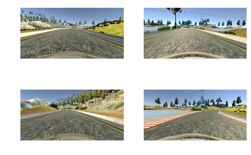


In the images above we can se that some parts of it may not be of use for the network and may cause waste of time and memory resources. Then we can crop the upper part, and also part of the bottom where a part of the car is visible.

For that purpose we define the next "constants"

```python
BOTTOM_MARGIN = 50
TOP_MARGIN = 140
```
("Constants" because python does not supports non-modifiable values by default.)

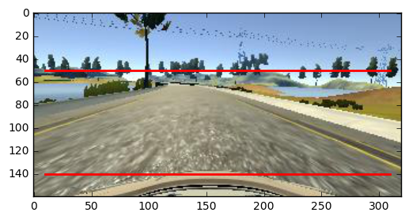  


## Analyze the data.

The generated CSV file is ordered as folows.

| center image | left image     | right image |  steering angle  |  throttle | Break | Speed |
| :------------- | :------------- |


This histogram is from the data provided by Udacity, it's quite visible that is not balanced


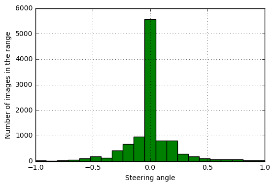

I added three more data sets for the regions where I was having problems, those where the curve
after the bridge, the curve after and the entrance to the bridge.

Here are the images and dataset distribution.

#### Parking-lot.

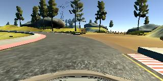

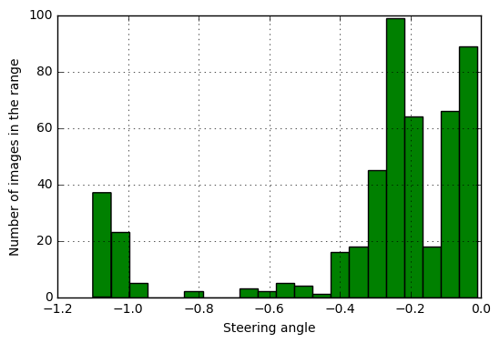
- - -

#### Curve to the left.
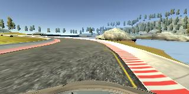
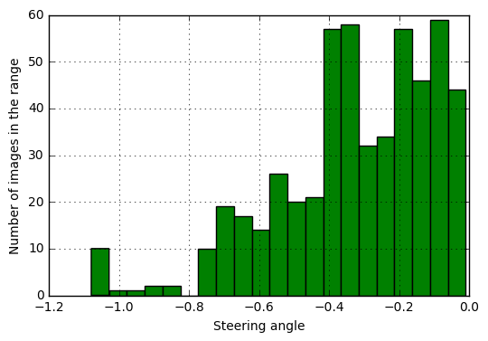

- - -
### Curve to the right.
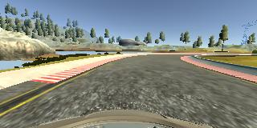
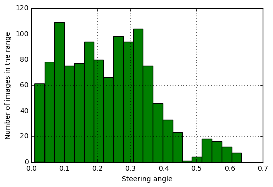
- - -

As described int the image is clear that our data is skewed by straigth driving samples. Then it's neccessary to balance the data, this will be done by getting more data and also with data augmentation.

I reused some of the scripts used in the last project to apply mirroring, shift the image in horizontal and vertical directions.

Here is a sample of the output generated from the augmentation:
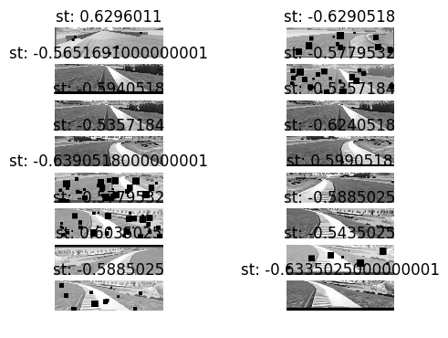

Now that a method to generate data is available we need to balance the data.
In this project the data was separated following the bin limits and then add elements randomly using the `random.uniform()` distribution.

Here is the distribution of the final dataset.

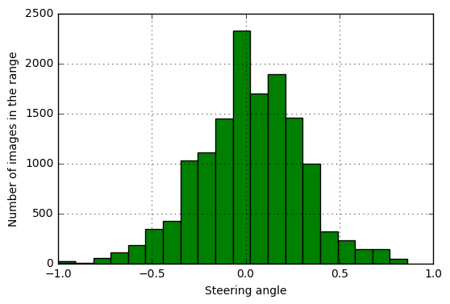


The network was based on the Nvidias paper, available in this repo. [link](https://github.com/yhoazk/CarND-Behavioral-Cloning-P3/blob/master/end-to-end-dl-using-px.pdf)

Here is the image of the architecture, the image was generated with Keras plot.


The summary of the architecture is:
```
____________________________________________________________________________________________________
Layer (type)                     Output Shape          Param #     Connected to                     
====================================================================================================
convolution2d_1 (Convolution2D)  (None, 90, 320, 1)    2           convolution2d_input_1[0][0]      
____________________________________________________________________________________________________
convolution2d_2 (Convolution2D)  (None, 83, 313, 24)   1560        convolution2d_1[0][0]            
____________________________________________________________________________________________________
maxpooling2d_1 (MaxPooling2D)    (None, 41, 156, 24)   0           convolution2d_2[0][0]            
____________________________________________________________________________________________________
dropout_1 (Dropout)              (None, 41, 156, 24)   0           maxpooling2d_1[0][0]             
____________________________________________________________________________________________________
convolution2d_3 (Convolution2D)  (None, 37, 152, 36)   21636       dropout_1[0][0]                  
____________________________________________________________________________________________________
maxpooling2d_2 (MaxPooling2D)    (None, 18, 76, 36)    0           convolution2d_3[0][0]            
____________________________________________________________________________________________________
dropout_2 (Dropout)              (None, 18, 76, 36)    0           maxpooling2d_2[0][0]             
____________________________________________________________________________________________________
convolution2d_4 (Convolution2D)  (None, 16, 74, 48)    15600       dropout_2[0][0]                  
____________________________________________________________________________________________________
maxpooling2d_3 (MaxPooling2D)    (None, 8, 37, 48)     0           convolution2d_4[0][0]            
____________________________________________________________________________________________________
dropout_3 (Dropout)              (None, 8, 37, 48)     0           maxpooling2d_3[0][0]             
____________________________________________________________________________________________________
convolution2d_5 (Convolution2D)  (None, 6, 35, 64)     27712       dropout_3[0][0]                  
____________________________________________________________________________________________________
maxpooling2d_4 (MaxPooling2D)    (None, 3, 17, 64)     0           convolution2d_5[0][0]            
____________________________________________________________________________________________________
dropout_4 (Dropout)              (None, 3, 17, 64)     0           maxpooling2d_4[0][0]             
____________________________________________________________________________________________________
flatten_1 (Flatten)              (None, 3264)          0           dropout_4[0][0]                  
____________________________________________________________________________________________________
dense_1 (Dense)                  (None, 1024)          3343360     flatten_1[0][0]                  
____________________________________________________________________________________________________
dense_2 (Dense)                  (None, 512)           524800      dense_1[0][0]                    
____________________________________________________________________________________________________
dense_3 (Dense)                  (None, 256)           131328      dense_2[0][0]                    
____________________________________________________________________________________________________
dense_4 (Dense)                  (None, 128)           32896       dense_3[0][0]                    
____________________________________________________________________________________________________
dense_5 (Dense)                  (None, 64)            8256        dense_4[0][0]                    
____________________________________________________________________________________________________
dense_6 (Dense)                  (None, 32)            2080        dense_5[0][0]                    
____________________________________________________________________________________________________
dense_7 (Dense)                  (None, 1)             33          dense_6[0][0]                    
====================================================================================================
Total params: 4109263
```

The Demo video is available here:

[](https://www.youtube.com/watch?v=68aOj9OH0NU)


 - - -
notes:

Command to run the DS4

```
sudo ds4drv  --trackpad-mouse --dump-reports --emulate-xboxdrv
```
